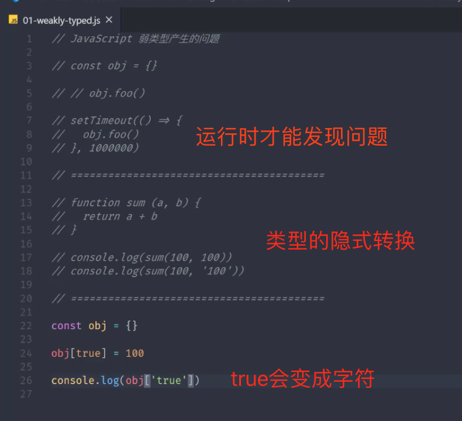
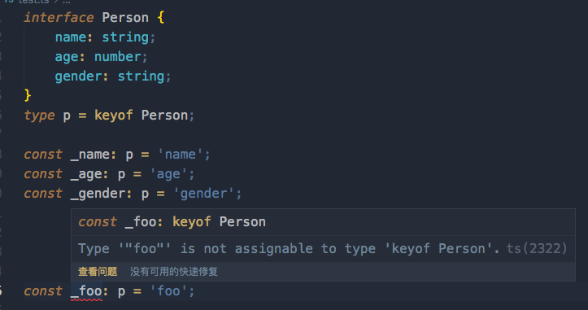
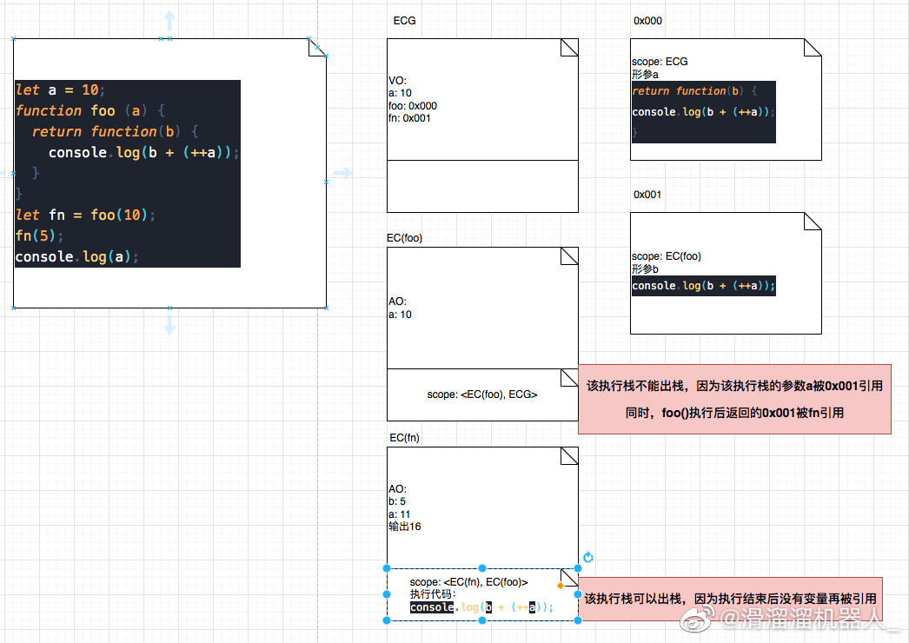
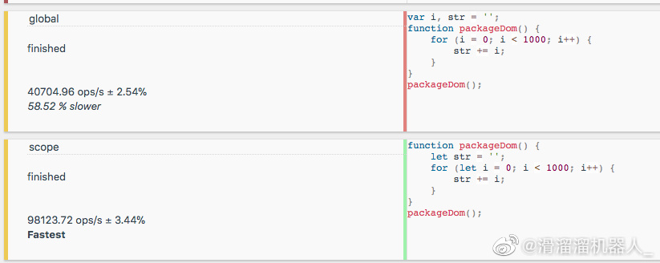
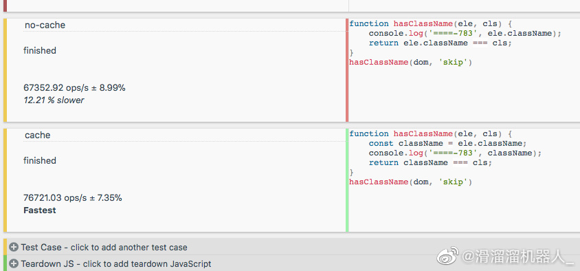

#### 块级作用域
```javascript
var elements = [{}, {}, {}];
for (var i = 0; i < elements.length; i++) {
    elements[i].onclick = (function(i) {
        return function () {
            console.log('i====-6', i);
        }
    })(i);
}
for (let i = 0; i < elements.length; i++) {
    elements[i].onclick = function () {
        console.log('i====-6', i);
    };
}
```
#### 解构
数组：
```javascript
const arr = [1,2,3];
const [,,baz] = arr; // 获取第三个值
const [ foo = 'default', bar, baz] = arr; // 设置默认值
const [foo, ...rest] = arr; // 获取剩余的值
```
对象
```javascript
const obj = { name: 'helen' };
const { name: objName = 'glowd' } = obj;
console.log('====-30', objName);
```
#### 带标签的字符串模板
```javascript
function splitStr (str, name, gender) {
    console.log('str====-34', str);
}
const name = 'tom';
const gender = true;
splitStr`Hey ${name} is a ${gender}`; // [ 'Hey ', ' is a ', '' ]
```
#### 字符串扩展
startWith
endWith
includes

#### 参数默认值
当没有传参数，或者参数为undefined时会使用默认值

#### 剩余参数
```javascript
function test (...args) {}

```
#### 展开数组
#### 箭头函数
关于箭头函数的this指向：
##### 先看一下一般函数和对象中，this关键字的指向
this永远指向调用自己的函数对应的对象，也就是说this只在乎谁调用了他，根在哪里进行的函数声明没有关系。
```javascript
function foo () {
    var a = 1;
    console.log(this.a);
}
foo();  // undefined 如果函数在最外层执行，那么调用这个函数的对象就是window，而window上没有a这个属性，所以是undefined
```
```javascript
var a = 1;
function foo() {
    console.log(this.a);
}
foo(); // 1
```
```javascript
var name = 'Helen';
var obj = {
    name: 'Glowd',
    sayHi() {
        console.log(this.name);
    }
};
obj.sayHi(); // Glowd
```
```javascript
var name = 'Helen';
var obj = {
    name: 'Glowd',
    sayHi() {
        return function () {
            console.log(this.name);
        }
    },
};
var sayHi = obj.sayHi();
sayHi(); // Helen
```
#### 再看一下箭头函数的this指向
箭头函数的this对象，就是定义"该函数时所在的作用域指向的对象"，而不是使用时所在的作用域指向的对象
```javascript
var obj = {
    name: 'Helen',
    sayHi: () => {
        console.log(this.name);
    },
}
obj.sayHi(); // undefined
```
如上述所说，定义“该函数所在的作用域指向的对象”，作用域是指函数内部，这里的箭头函数也就是sayHi，他的作用域其实是最外层的js环境，因为没有其他的包裹；然后最外层的js环境指向的对象是window，所以这里的this指向的是window对象。
```javascript
const obj = {
    name: 'Helen',
    sayHi: function() {
        const s = () => console.log(this.name);
        return s;
    }
}
const sayHi = obj.sayHi();
sayHi(); // Helen
```
s定义时所在的作用域就是sayHi这个方法.

最后是使用箭头函数其他几点需要注意的地方:
1. 不可以当作构造函数，也就是说，不可以使用new命令，否则会抛出一个错误。
2. 不可以使用arguments对象，该对象在函数体内不存在。如果要用，可以用 rest 参数代替。
3. 不可以使用yield命令，因此箭头函数不能用作 Generator 函数。

#### 对象字面量的增强
计算属性名：
```javascript
const obj = {
    [Math.random]: '...',
}
```
#### Object.assign
```javascript
const result = Object.assign(target, source1, source2);
console.log(result === target); // true
```
常见用法：
```javascript
function func (obj) {
    const funcObj = Object.assign({}, obj);
    funcObj.name = 'Glowd';
    console.log(funcObj); //  { name: 'Glowd' }
    console.log(obj); // { name: 'Helen' }
}
const obj = { name: 'Helen' };
func(obj)
```
上述实现，可以避免修改带源对象obj

#### Object.is
```javascript
Object.is(NaN, NaN); // true
NaN === NaN // false
```

#### Proxy
基本用法
```javascript
const person = {
    name: 'Helen',
    age: 18,
}
const proxyPerson = new Proxy(person, {
    get(target, property) {
        console.log('get');
        return target[property];
    },
    set(target, property, value) {
        console.log('set');
        target[property] = value;
    }
});

console.log(proxyPerson.name); // get
```

#### Proxy相比于definedProperty
监听的功能更完善
可以监听delete操作
```javascript
const person = {
    name: 'Helen',
    age: 18,
}
const proxyPerson = new Proxy(person, {
    deleteProperty(target, property) {
        console.log('delete');
        delete target[property];
    }
});
delete proxyPerson.name; // delete
```
proxy还可以监听数组
```javascript
const arr = [];
const proxyArr = new Proxy(arr, {
    set(target, property, value) {
        console.log('set', property, value);
        target[property] = value;
        return true;
    }
});
proxyArr.push(100); // set 0 100, set length 1
```

#### Reflect
Reflect成员方法就是Proxy处理对象的默认实现
例如：
当我们new一个Proxy，里面没有定义get和set方法，Proxy内部的默认实现逻辑就是调用了Reflect内部默认的方法
```javascript
const person = {
    name: 'Helen',
    age: 18,
};
const proxyObj = new Proxy(person, {

}); // 没有定义get和set方法
```
等同于
```javascript
const person = {
    name: 'Helen',
    age: 18,
};
const proxyObj = new Proxy(person, {
    get(target, property) {
        return Reflect.get(target, property);
    }
});
```
Reflect存在的意义：统一对象操作

#### 静态方法
static

#### 类的继承

#### Set
```javascript
const s = new Set();
s.add(1).add(2).add(2);

s.forEach((i) => console.log(i));

for (const i of s) {
    console.log(i);
}

console.log(s.size());

console.log(s.has(100));

s.delete(100);

s.clear();

const result1 = Array.from(new Set([1,2,3,3]));
const result1 = [...new Set([1,2,3,3])];
```

#### Map
```javascript
const m = new Map();
const tom = { name: 'Tom' };
m.set(tom, 1);
m.get(tom);
m.has(tom);
m.forEach((value, key) => {
    console.log(value, key); // 1, { name: 'Tom' }, 
})
```

#### Symbol
```javascript
const name = Symbol();

const obj = {
    [name]: 'Helen',
    say() {
        console.log(this[name]);
    },
}
```
```javascript
const test1 = Symbol.for('key');
const test2 = Symbol.for('key');

console.log(test1 === test2); // true
```
Object.keys和JSON.stringify都不能拿到Symbol属性
```javascript
const test1 = Symbol.for('key');
const test2 = Symbol.for('key');

const obj = {
    [Symbol.for('cover')]: 'test',
}
console.log(obj[Symbol.for('cover')]); // test
```

#### for...of
```javascript
const m = new Map();
m.set('foo', 123);
m.set('bar', 321);
for (const [key, value] of m) {
    console.log(key, value);
}
```

#### Interable
实现iterable接口，就可以使用for...of
首先看数组，Set，Map数据结构都有一个Symbol.iterator 方法，调用该方法，会返回一个next方法，next方法会编译对象，
返回{ value: ..., done: false };
```javascript
const m = new Map();
m.set('foo', 123);
m.set('bar', 321);
const iterator = m[Symbol.iterator]();

console.log('====-6', iterator.next());
```

实现Iteratle接口
```javascript
const obj = {
    list: [1,2,3,4],
    [Symbol.iterator]: function() {
        let indext = 0;
        return {
            next: () => {
                return {
                    value: this.list[indext],
                    done: indext++ >= this.list.length,
                }
            }
        }
    },
};

for (const val of obj) {
    console.log('====-16', val);
}
```
迭代器对外提供统一遍历接口，外部不用关系遍历的数据结构。

#### 生成器
```javascript
function * foo () {
    console.log(100);
    yield 1;
    console.log(200);
    yield 2;
}
const gen = foo();
gen.next(); // { value: 1, done: false }
gen.next(); // { value: 2, done: true }
```

```javascript
const obj = {
    list: [1,2,3,4],
    [Symbol.iterator]: function * () {
        for (const val of this.list) {
            yield val;
        }
    },
};

for (const val of obj) {
    console.log('====-16', val);
}
```

#### ES2016
- includes
- 指数运算符
2 ** 10 === Math.power(2, 10) // true

#### ES2017
- Object.values()
- Object.entries()
- Object.getOwnPropertyDescriptors()
获取对象完整的属性描述信息
```javascript
const obj = {
    key1: 'value1',
    key2: 'value2',
    get fullName() {
        return `${this.key1} ${this.key2}`;
    }
};

const obj2 = Object.assign({}, obj);
obj2.key1 = 'value3';
console.log(obj2); // { key1: 'value1', key2: 'value2', fullName: 'value1 value2' }
```
上述情况，Object.assign在复制的时候会把fullName当做普通的属性进行复制

```javascript
const obj = {
    key1: 'value1',
    key2: 'value2',
    get fullName() {
        return `${this.key1} ${this.key2}`;
    }
};
const objDes = Object.getOwnPropertyDescriptors(obj);

const obj2 = Object.defineProperties({}, objDes);
obj2.key1 = 'value3';

console.log('obj2====-10', obj2.fullName);
```

#### padStart & padEnd
会使打印更规整
```javascript
const books = {
    html: 5,
    css: 10,
    js: 209,
};
for (const [key, value] of Object.entries(books)) {
    console.log(`${key.padEnd(16, '-')}${value.toString().padStart(3, '0')}`);
}
/**
html------------005
css-------------010
js--------------209
**/
```

### Typescript
#### 强类型和弱类型（类型安全）
是否允许随意的隐式类型转换
#### 静态类型与动态类型（类型检查）
是否随时允许变量类型的变化
#### 弱类型的问题

#### 强类型的优势
1. 错误可以更早的暴露
2. 代码更智能，编码更准确(编辑器提示)
3. 重构更可靠
4. 减少不必要的类型判断

#### Flow快速上手
步骤
1. 在项目中安装"flow-bin"
2. 需要在需要类型检测的文件顶部添加： "// @flow"
3. 给参数添加类型注释
#### Flow编译移除注解
1. flow-remove-types (flow-remove-types src -d dist)
2. @bable/preset-flow (babel src -d dist)

#### Flow开发工具插件
vscode 开发工具插件：Flow Language Support 
可以在代码中标红
显示代码编译状态

#### Flow类型推断
flow会根据代码传入的参数，来推断类型
```javascript
function square(n) {
    return n * n;
}
square('100')
```
以上代码flow会报错

#### Flow 对象类型
```javascript
const obj1: { foo: string, bar: number } = { foo: 'test', bar: 1 };
const obj2: { foo?: string, bar: number } = { bar: 1 };
const obj: {[string]: string} // obj的键和值都只能是string类型
```

#### 函数的类型限制
```javascript
function foo(callback: (string, number): void) {
    callback('string', 123);
}
foo(function (str, n) {
    // str => string
    // n => number
})
```
#### 特殊类型
```javascript
const a: 'foo' = 'foo'; // 这里只能给a赋值为'foo'
const b: string | number = 1; // b可以是string和number
type StringOrNumber = string | number;
const c: StringOrNumber = 1; // 此时c与b相同烈性
const d: ?number = null; // maybe类型 d可以是number，null, void, undefined
```
#### Mixed与Any
- 用Mixed定义的变量还是强类型
需要在使用变量前判断变量类型
- Any是把变量定义成了弱类型

#### 小结
type查询：https://flow.org/en/docs/types/
https://www.saltycrane.com/cheat-sheets/flow-type/latest/

#### Flow运行环境API

### TypeScript
#### TypeScript快速上手
1. 安装typescript
2. 使用tsc命令编译ts文件
tsc不仅会对类型进行编译，还会将es语法编译到es3
#### TypeScript配置文件
使用命令“tsc --init“ 来生成tsconfig.json
只有tsc编译整个项目的时候才会使用tsconfig.json的配置，在编译单个文件的时候不会使用

#### TypeScript 原始类型
```typescript
const a: number = 1;
const b: string = '1';
const c: boolean = true;
const d: boolean = null; // 严格模式下boolean的类型不能赋值为null，非严格模式的可以
const e: void = undefined;
const f: null = null;
const g: undefined = undefined;
```
#### TypeScript 标准库声明
标准库就是js内置对象所对应的声明
tsconfig.json配置
target: 是指定tsc编译后的版本目录
lib： 指定要包含在编译中的库文件

#### TypeScript 中文错误消息
1. tsc --locale zh-CN
2. 在vscode中设置ts提示消息为 zh-CN

#### TypeScript 作用域的问题
如果在文件1中定义的a变量，在文件2中又定义了a变量，就会出现变量重复定义的问题
原因是直接定义的变量是全局变量，那么解决的方法：
1. 写成自执行函数
2. 写成模块，因为模块会有自己的作用域
```typescript
const a = 1;
export {a};
```
#### TypeScript Object类型
TypeScript 中的Object类型，是指对象，数组，函数
```typescript
const a: object = {};
const b: object = [];
const c: object = function () {};
```
Object类型可以定义对象成员的类型
```typescript
const e: {foo: string, bar: number} = { foo: 'foo', bar: 1};
```
但是一般会用接口的方式来定义对象成员类型
#### TypeScript 数组类型
```typescript
const a: Array<number> = [1,2,3];
const b: number[] = [1,2,3];
```

```typescript
function sum(...args: number[]) {
    return args.reduce((curr, prev) => curr + prev, 0);
}
sum(1,2,'3'); // error
```
#### TypeScript 元组类型
元组类型其实就是明确数组中每一个元素的类型，和数组元素数量的类型
```typescript
const a: [string, number] = ['hello', 3]; // 类型必须对应，元素数量也必须对应
```
react中的使用场景
```typescript
const [a, setA] = useState('a');
```
```typescript
const result = Object.entries({
    foo: 123,
    bar: 321,
}); // [['foo', 123],['bar', 123]]
```

#### TypeScript 枚举类型
在开发中我们经常涉及到用数值去代表某几种中状态
那么就可以用枚举类型
```typescript
enum PostStatus {
    Draft = 0,
    unpublish = 1,
    publish = 2,
}
const post = {
    title: 'hello typescript',
    content: 'typescript is typed superset of js',
    status: PostStatus.Draft,
}
```
编译后：（可以看出枚举类型会对原本代码做侵入）
```javascript
"use strict";
var PostStatus;
(function (PostStatus) {
    PostStatus[PostStatus["Draft"] = 0] = "Draft";
    PostStatus[PostStatus["unpublish"] = 1] = "unpublish";
    PostStatus[PostStatus["publish"] = 2] = "publish";
})(PostStatus || (PostStatus = {}));
var post = {
    title: 'hello typescript',
    content: 'typescript is typed superset of js',
    status: PostStatus.Draft,
};
```
上面是个双向键值对，我们可以通过索引的方式访问键：PostStatus[0]
但是如果确定不会使用索引的方式访问，可以定位为常量枚举
```typescript
const enum PostStatus {
    Draft = 0,
    unpublish = 1,
    publish = 2,
}
const post = {
    title: 'hello typescript',
    content: 'typescript is typed superset of js',
    status: PostStatus.Draft,
}
```
编译后：
```javascript
"use strict";
var post = {
    title: 'hello typescript',
    content: 'typescript is typed superset of js',
    status: 0 /* Draft */,
};
```
会以注释的方式标注键

枚举类型的数值会自增长
```typescript
const enum PostStatus {
    Draft,
    unpublish,
    publish,
}
```
PostStatus.Draft 等于0
PostStatus.unpublish 等于1
PostStatus.publish 等于2

#### TypeScript 函数类型
对输入，输出的类型约束
函数有两种定义方式：表达式，函数声明
函数声明
```typescript
function func1(a: number, b: number, ...rest:number[]): string {
    return 'func1';
}
func1(1, 2, 3);

const func2: (a: number, b: number) => number = function (a: number, b: number): number {
    return a + b;
}
```

#### TypeScript 任意类型
any
主要用于兼容老代码
#### TypeScript 隐式类型推断
```typescript
let age = 10; // ts会推断age为number
age = 'test'; // 此时会报错，因为ts推断age为number
```
如果ts不能判断变量类型，就会推断为any
```typescript
let foo;
foo = 100;
foo = 'string'
```
foo被ts推断为any，所以上面代码不会报错
但是仍然建议为每个变量添加明确的类型
#### TypeScript 类型断言
当我们明确知道某个变量的类型，但是在声明阶段没有定义，则可以使用类型断言
两种方式：
1. as
```typescript
// 假定这个nums来自一个明确的接口
const nums = [110, 120, 119, 112];
const res = nums.find(num => num > 112);

const num1 = res as number;
```
2. <>
```typescript
const num1 = <number>res;
```
方法二会在jsx中与标签冲突，所以推荐方法1

#### TypeScript 接口
接口就是用来约束对象的结构，一个对象去实现接口，就必须拥有接口所定义的所有成员
```typescript
interface Post {
    title: string;
    content: string;
}

function printPost(post: Post) {
    console.log('====-8', post.title);
    console.log('====-8', post.content);
}
printPost({
    title: 'Hello Typescript',
    content: 'Typescript is a js superset',
});
```
可选成员
```typescript
interface Post {
    title: string;
    content: string;
    subtitle?: string; // 可选
}
```
只读成员
```typescript
interface Post {
    title: string;
    content: string;
    subtitle?: string; // 可选
    readonly summary: string;
}
```
```typescript
interface Post {
    title: string;
    content: string;
    subtitle?: string; // 可选
    readonly summary: string;
}

function printPost(post: Post) {
    console.log('====-8', post.title);
    console.log('====-8', post.content);
}

const hi: Post = {
    title: 'Hello Typescript',
    content: 'Typescript is a js superset',
    summary: 'test',
};

hi.summary = '2'; // 此时会报错，一旦赋值给readonly就不能修改
printPost(hi);
```
动态成员
```typescript
interface Cache {
    [key: string]: string
}
const cache: Cache = {};
cache.foo = 'foo'; // 可以动态的给键赋值
```
以上代码表示只能是string类型的键值，键的名字可以任意取

#### TypeScript 类的基本使用
在ts中不能直接在constructor 中动态添加属性
必须先声明
属性必须赋初始值，可以在constructor中赋初始值，也可以初始化的时候赋值
类方法可以使用函数声明的方法声明类型
```typescript
class Person {
    name: string; //必须先声明
    age: number; //必须先声明
    constructor() {
        this.name = 'helen';
        this.age = 19
    }
    sayHi(str: string) {
        console.log(`Hi ${str}`);
    }
}
```
#### TypeScript 类的访问修饰符
private
public
protected
```typescript
export {}; // 确保跟其他示例成员没有冲突

class Person {
    public name: string; // 默认是public，可以在实例对象上访问
    private age: number; // 不能在实例对象上访问，并且子类不继承该属性
    protected gender: string; // 不能在实例对象上访问，子类可以继承该属性
    constructor(name: string, age: number, gender: string) {
        this.name = name;
        this.age = age;
        this.gender = gender;
    }
    sayHi(str: string) {
        console.log(`Hi ${str}`);
    }
}

const tom = new Person('Helen', 18, 'female');

console.log(tom.age); // Error: 属性“gender”受保护，只能在类“Person”及其子类中访问。
console.log(tom.gender); // Error: 属性“gender”受保护，只能在类“Person”及其子类中访问。
```
```typescript
class Student extends Person {
    constructor(name: string, age: number, gender: string) {
        super(name, age, gender);
        console.log('====-22', this.age); // Error: 属性“age”为私有属性，只能在类“Person”中访问。
        console.log('====-23', this.gender); // 可以正常访问
    }
}
```
构造函数也可以设置为private，这个时候外部不能直接通过new的方式来实例化
```typescript
class Student extends Person {
    private constructor(name: string, age: number, gender: string) {
        super(name, age, gender);
        console.log('====-23', this.gender);
    }
}
const jack = new Student(); // 类“Student”的构造函数是私有的，仅可在类声明中访问。
```
所以需要用静态方法
```typescript
class Student extends Person {
    private constructor(name: string, age: number, gender: string) {
        super(name, age, gender);
        console.log('====-23', this.gender);
    }
    static create(name: string, age: number, gender: string) {
        return new Student(name, age, gender);
    }
}
const jack = Student.create('Helen', 18, 'female');
```
#### TypeScript 类的只读属性
如果属性已经有其他修饰符，readonly修饰符需要放在修饰后面
readonly的属性，只能在初始化或者构造函数中初始化，二者选其一
初始化后就不能在修改，内部和外部都不行
```typescript
class Person {
    public readonly name: string;
    private age: number;
    protected gender: string;
    constructor(name: string, age: number, gender: string) {
        this.name = name;
        this.age = age;
        this.gender = gender;
    }
    sayHi(str: string) {
        console.log(`Hi ${str}`);
    }
}
const tom = new Person('tom', 19, 'male');
tom.name = 'helen'; // 无法分配到 "name" ，因为它是只读属性
```
#### TypeScript 类与接口
```typescript
interface EatAndRun {
    eat(food: string): void;
    run(instance: string): void;
}

class Person implements EatAndRun {
    eat(food: string) {
        console.log('优雅的进餐', food);
    }
    run(instance: string) {
        console.log('直立行走', instance);
    }
}
class Animal implements EatAndRun {
    eat(food: string) {
        console.log('呼噜呼噜得吃', food);
    }
    run(instance: string) {
        console.log('爬行', instance);
    }
}
```
一个接口只实现一个功能 
```typescript
interface Eat {
    eat(food: string): void;
}
interface Run {
    eat(food: string): void;
    run(instance: string): void;
}
class Person implements Eat,Run {
    eat(food: string) {
        console.log('优雅的进餐', food);
    }
    run(instance: string) {
        console.log('直立行走', instance);
    }
}
```
#### TypeScript 抽象类
抽象类可以用来约束子类中必须要有某个成员，但是不同于接口的是，抽象类可以包含一些具体的实现，接口不包含实现
被定义成抽象类后，只能被继承，不能用new的方式创建实例对象
可以定义抽象方法，修饰符是abstract，抽象方法不用事先，只是约束类型
```typescript
abstract class Animal {
    eat(food: string) {
        console.log('呼噜呼噜得吃', food);
    }
    abstract run (distance: number): void
}

class Dog extends Animal {
    run(distance: number): void {
        console.log('爬行', distance);
    }
}
```
#### TypeScript 泛型
可以再运行的时候在定义类型
```typescript
function createArray<T>(length: number, value: T): Array<T> {
    return Array<T>(length).fill(value);
}
createArray(10, 20);
createArray(10, 'helen');
```

```typescript
function identity<T>(arg: T): T {
    return arg;
}
// 两种调用方式
identity<number>(1); // 明确指出泛型的类型
identity(1) // 类型推到
```
##### 泛型变量
ts会把它当做任意类型
```typescript
function identity<T>(arg: T): T {
    console.log('====-945', arg.length); // 会报错，因为arg不一定有length属性
    return arg;
}
```
可以把以上代码改为
```typescript
function identity<T>(arg: T[]): T[] {
    console.log('====-945', arg.length); // 不会报错
    return arg;
}
```
如上述代码，可以把T作为类型声明的一部分

##### 泛型函数
```typescript
function identity<T>(arg: T): T {
    return arg;
}
const myIdentity: <T>(arg: T) => T = identity; 
// `<T>(arg: T) => T`称为泛型函数的类型
```
还可以用对象字面量
```typescript
function identity<T>(arg: T): T {
    return arg;
}
const myIdentity: {<T>(arg: T): T} = identity; 
```
##### 泛型接口
```typescript
interface GenericIdentityFn {
    <T>(arg: T): T;
}
function identity<T>(arg: T): T {
    return arg;
}
const myIdentity: GenericIdentityFn = identity;
```
```typescript
interface GenericIdentityFn<T> {
    (arg: T): T;
}
// 这是在使用GenericIdentityFn接口是必须指定类型
const myIdentity: GenericIdentityFn<number> = identity;
```
##### 泛型类
```typescript
class GenericNumber<T> {
    zeroNum: T;
    add: (x: T, y: T) => T;
}
// new 这个类时需要指定类型
const myGenericNumber = new GenericNumber<number>();
myGenericNumber.zeroNum = 1;
myGenericNumber.add = (x: number, y: number) => {
    return x + y;
};
```
##### 泛型约束
```typescript
function logginIdentity<T>(arg: T): T {
    console.log(arg.length); // 此时会报错，因为T可能没有length属性
    return arg;
}
```
解决方法：
1. 将参数类型改为类型数组
```typescript
function logginIdentity<T>(arg: T[]): T[] {
    console.log(arg.length);
    return arg;
}
```
2. 让泛型继承接口
```typescript
interface Lengthwise {
    length: number;
}
function logginIdentity<T extends Lengthwise>(arg: T): T {
    console.log(arg.length);
    return arg;
}
```

```typescript
function getProperty<T, K extends keyof T>(obj: T, key: K) {
    return obj[key];
}
const x = { a: 1, b: 2, c: 3 }
getProperty(x, 'm'); // 报错，因为m不在x中: Argument of type '"m"' is not assignable to parameter of type '"a" | "b" | "c"'
getProperty(x, 'a'); // 不报错
```
3. 泛型在工厂函数中的应用
```typescript
function create<T>(c: { new(): T }): T {
    return new c();
}
```
这里的`new()`表示一个构造器
`T` 表示这个类的一个实例
`c` 是一个类
最终返回c的实例

4. 泛型约束

```typescript
class BeeKeeper {
    hasMask: boolean;
}
class LionKeeper {
    nametag: string;
}
class Animal {
    numLength: number;
}

class Bee extends Animal {
    keeper: BeeKeeper;
}
class Lion extends Animal {
    keeper: LionKeeper;
}

function createInstance<T extends Animal>(C: { new (): T }): T {
    return new C();
}
const nametag = createInstance(Lion).keeper.nametag;
const hasMask = createInstance(Bee).keeper.hasMask;
```
#### 泛型中keyof的用法
ts中keyof是将一个类型映射为他所有成员名称的联合类型
```typescript
interface Person {
    name: string;
    age: number;
    gender: string;
}
type p = keyof Person; // 'name' | 'age' | 'gender'
```

再来生命一个Student类
```typescript
class Student {
  constructor(private info) {
      this.info = info
  }

  getInfo(key: string) {
    if(key === 'name' || key === 'age' || key ==='gender') {
      return this.info[key];
    }
  }
}
const student = new Student({
  name: 'uuuu',
  age: 20,
  gender: 'male'
})
const test = student.getInfo('name');
console.log(test)
```
我们可以看到，在实例student中，如果我们调用了getInfo方法，传入key值，如果不做校验，
也就是if中的判断条件，key值是没有被限制的可以任意传值，就会导致程序报错。
即使加了if的校验，也只能保证不报错，当传入的是name、age、gender以外的key值，
程序返回值便是undefined，这时候就体现了keyof的作用

下面用keyof来实现
```typescript
interface Person {
    name: string;
    age: number;
    gender: string;
}
class Student {
  constructor(private info) {
    this.info = info;
  }
  getInfo(key: keyof Person) {
      return this.info[key];
  }
}
```
#### Partial类型
```typescript
// type Module = {
//     pre: '';
//     create: '';
//     update: '';
// };
type Module = Partial<{
    pre: string;
    create: string;
    update: string;
}>;

const module: Module = {
    pre: '',
};
```typescript
使用Partial转换之后，等同于
```typescript
type Module = {
    pre?: string | undefined;
    create?: string | undefined;
    update?: string | undefined;
};
```
Partial的定义：
```typescript
type Partial<T> = {
    [P in keyof T]: T[P]
};
```
#### in: 映射类型
`[P in Keys]`
P：类型变量，依次绑定到每个属性上，对应每个属性名的类型
Keys: 字符串字面量构成的联合类型，表示一组属性名（的类型）
#### T[P]：索引访问操作符
可以访问属性名对应的属性值类型
#### ! 断言操作符
! 的作用是断言某个变量不会是null/undefined，告诉编辑器停止报错
```typescript
const obj = {
    name: 'Foo'
};
const name = obj.name!;
```
假设 obj是你从后端获取的获取确定 obj.name 一定是存在的且不是null/undefined，使用! 只是消除编辑器报错，不会对运行有任何影响
属性或参数中使用!，表示强制解析（告诉编辑器这里一定有值），在变量后使用!，表示类型推荐，排除null/undefined
https://baijiahao.baidu.com/s?id=1713556086622537304&wfr=spider&for=pc

#### is关键字
is被称为类型谓词，用来判断一个变量是否属于某个类型或者接口。
如果需要封装一个类型判断函数，应该第一时间想到ta
is关键字一般用于函数的返回值类型中，判断变量是否属于某一类型，并根据结果返回布尔类型: `prop is type`

示例：
在一些兑换码场景，经常会需要将兑换码全部转为大写，之后再进行判断：
```typescript
function isString(s: unknown): boolean {
  return typeof s === 'string';
}
function toUpperCase(x: unknown) {
  if (isString(x)) {
    x.toUpperCase(); // Object is of type 'unknown'.ts(2571)
  }
}
```
上述代码会有以上报错，可以改为：
```typescript
function isString(s: unknown): s is string {
  return typeof s === 'string';
}
function toUpperCase(x: unknown) {
  if (isString(x)) {
    x.toUpperCase();
  }
}
```
解释：通过`is`可以将类型范围缩小为string类型

#### unknown 和 any
1. 所有类型都可以赋值给`unknown`
2. 我们只能将`unknown`类型的变量赋值给`any`或者`unknown`
3. 如果不缩小范围，就不能对`unknown`类型执行任何操作
```typescript
const a: unknown = 'a';
a.toUppercase(); // Object is of type 'unknown'.ts(2571)
```
- 可以使用类型断言缩小未知范围
```typescript
const a: unknown = 'a';
(a as string).toUppercase(); 
```
- 使用类型收缩
```typescript
const a: unknown = 'a';
if (typeof a === 'string') {
  a.toUppercase();
}
```
TypeScript 编译器会分析我们的代码，并找出一个更窄的类型。

#### never
never是指永远不存在的值
一般抛出异常和死循环的函数的返回值类型是never
- 抛出异常会直接终端函数的运行，这样程序就运行不到函数返回的那一步了，即具有不可到达的终点，也就不存在返回值了
- 同样死循环的函数也无法到达函数返回的那一步，即不存在返回值
任何类型都不能赋值给never类型(除了never本身之外)
never 是其它类型（包括 null 和 undefined）的子类型


### Javascript性能优化
#### 内存管理
#### 垃圾回收
##### javascript中的垃圾
1. 无法从根上访问
2. 对象不再被引用
3. js的垃圾回收时自动的

```javascript
function objGroup (obj1, obj2) {
    obj1.next = obj2;
    obj2.prev = obj1;
    return {
        o1: obj1,
        o2: obj2,
    }
}

const obj = objGroup({name: 'obj1'}, {name: 'obj2'});
```

##### GC中的垃圾
1. 程序中不能被访问到的对象
2. 程序中不再需要使用的对象

##### GC算法是什么
查找垃圾
释放空间
回收空间

##### 引用计数算法
内部有一个引用计数器，它会记录每个对象被引用的次数，如果某个对象的引用计数为0，则就要回收和释放内存。
当引用关系发生改变时，引用计数器就回去修改数值

##### 引用计数的优点
发现垃圾立即回收
最大程度的减少程序暂停

##### 引用计数的缺点
1. 不能清除掉循环引用的对象
```javascript
function test() {
    const obj1 = {};
    const obj2 = {};
    obj1.name = obj2;
    obj2.name = obj1;
}
```
上述情况obj1,obj2不能被回收

2. 时间开销大（因为他自己会维护一个引用计数器，时刻监控引用计数的值）

##### 标记清除算法
1. 遍历所有对象找到活动对象并且标记（活动对象就是可达对象）
2. 遍历所有对象，找到没有标记的对象，然后清除掉，并且把清除后的空间放在一个空闲队列里，方便后期其他变量声明空间

##### 标记清除算法的优缺点
优点：可以清除循环引用的对象
缺点：空间碎片化


一般存储对象的内存空间分为两部分：1. 元信息（存放地址，大小）2. 存放对象本身

##### 标记整理算法
该算法第一步与标记清除算法相同：
遍历所有活动对象，做标记
第二部：
将活动对象整理成一个连续的地址
3. 然后将活动对象右侧（就是指不活动的对象）的位置做一个整体的回收
那么就解决了空间碎片化的问题

##### V8
1. V8是js执行引擎
2. V8的执行速度很快，因为他是即时编译（js代码直接编译成机器码，以前的一些编译器会先将js代码编译成二进制，再编译成机器码）
3. V8对内存设有上线，64位的电脑上限是1.5G

##### V8内存回收
首先，内存中的数据有基本类型的数据（栈内存中）和对象类型的数据（堆内存中），V8的内存回收是指的对象类型的数据的回收。

##### V8中的新生代区域怎么进行回收操作
新生代区域存放一些存活时间较短的对象
新生代区域分为两个区域：from和to
小空间用于存储新生代对象

刚开始使用from空间，空闲空间是to
from用来存放活动对象
当进行了标记整理算法后，在from空间中活动对象的地址连续，
然后将活动对象拷贝到to
然后将from的空间完全的释放掉，让from和to空间进行一个交换

回收的细节：
在拷贝的过程中，可能会将新生代区域中的对象晋升到老生带
那么在什么情况下会晋升？
1. 在一次GC后，仍然存活的对象
2. 当to区域的空间使用达到25%

##### V8的老生带区域怎么回收
老生带的垃圾回收有以下几步
1. 标记清除
2. 标记整理
3. 增量标记


老生带的回收首先是标记清除（此时空间碎片）
当新生代向老生带晋升，并且，老生带空间不足时，则进行标记整理
然后是使用增量标记，来提升标记速度
注意：程序的执行和垃圾回收操作是互斥的，当在执行程序时，垃圾回收会停止，当开始垃圾回收时，程序的执行是停止的。

##### Performance

##### 内存问题的表现
1. 页面的经常性的卡顿，页面出现延迟加载
原因可能是频繁的垃圾回收(浏览器在进行GC时，应用程序时停止的)
2. 页面持续性的出现糟糕的性能
原因可能是内存膨胀，当前界面，去申请的内存空间，远远大于设备所能提供的设备空间
3. 页面性能越来越差
原因可能是内存泄漏，就是随着程序的执行，内存空间越来越少（可能有分离dom）

##### 什么是分离DOM
DOM已经从dom树上删除，但是js中还在引用，就会分离DOM，就会内存泄漏
```javascript
let tempElm = null
function fn () {
    const ul = document.createElement('ul');

    for (let i = 0; i <= 10; i++) {
        ul.appendChild(document.createElement('li'));
        tempElm = ul;
    }
}
document.querySelector('#btn').addEventListener('click', () => fn);
```
从浏览器中的对快照里就可以看出分离DOM(detachedDom)，要清空分离dom，只需要将引用的js变量设置为null(tempElm = null)


##### 确定频繁的垃圾回收 
1. Timeline中频繁的上升下降
2. 任务管理器中数据频繁的增加和减少

##### V8引擎的工作流程


###### Scanner
Scanner会将js代码解析成token
```javascript
const username = 'foo';
```
Scanner后
```
[
    {

    }
]
```
###### Parser
语法分析的过程
将Scanner生成的token生成AST
PreParser
生成scope信息
Parser

###### 堆栈处理
基本数据类型，会直接存放在栈区
1. ECStack 执行环境栈，其实就是一块内存够
2. 执行上下文
- 一个js文件在执行的时候会有很多行代码，这些行一般会分块
- 如果将代码全都放在当前执行环境栈当中执行，就会出现命名冲突
- 所以每个代码块在执行的时候，都会有自己独立的执行环境
- 执行上下文是一个大环境，在这个环境当中会包含本段代码所需要的所有资源集合(数据，this, 作用域链)
3. ECG
默认情况下会存在一个全局执行上下文
4. VOG
全局执行上下文当中有一个对象，叫做全局对象，用来管理变量声明
5. GO
window

###### 引用类型堆栈处理
注意：
```javascript
obj1.y = obj1 = { x: 200 } // 
```
上述代码会先执行obj1.y，这是根据运算符的优先级，不管obj.y写在前面还是写在后面

代码分析：
```javascript
var obj1 = { x: 100 };
var obj2 = obj1;
obj1.y = obj1 = { x: 200 }
console.log(obj1.y)
console.log(obj2);
```


###### 函数的堆栈处理
```javascript
var arr = ['zce', 'alishi'];
function foo (obj) {
    obj[0] = 'zoe';
    obj = ['拉勾教育'];
    obj[1] = '大前端';
    console.log(obj);
}
foo(arr);
console.log(arr);
```
函数的创建：
- 可以将函数名称看作是变量，存放在VO中，它的值就是当前函数对应的内存地址
- 函数本身也是一个对象，创建时会有一个内存地址，空间内存放的就是函数体代码(字符串形式的)，作用域对象[scope]

函数执行：
- 函数执行时会形成一个全新的私有上下文，它里面有一个AO，用于管理这个上下文中的变量
- 步骤
1. 作用域链<当前执行上下文, 上级作用域所在的执行上下文>
2. 确定this
3. 初始化arguments
4. 形参赋值，他就相当于一个变量声明，然后将声明的变量放置于AO
5. 变量提升
6. 代码执行

###### 闭包堆栈处理
注意：
```javascript
var a = 1;
var b = 2;
var c = a + b++;
// c => 3
// b => 3
```
上述代码中的c会先计算a+b，然后b自增
https://kaiwu.lagou.com/xunlianying/index.html?courseId=17#/detail?weekId=765&lessonId=2302

###### 闭包与垃圾回收
```javascript
let a = 10;
function foo (a) {
    return function(b) {
        console.log(b + (++a));
    }
}
let fn = foo(10);
fn(5); // 16
foo(6)(7); // 14
fn(20); //32
console.log(a); // 10
```

###### 循环添加事件实现
```javascript
// 基础
const aButtons = document.querySelectorAll('button');
for (var i = 0; i < 3; i++) {
    aButtons[i].onclick = function () {
        console.log('====-688', i); // 3
    }
}
```
方法一：闭包
```javascript
const aButtons = document.querySelectorAll('button');
for (var i = 0; i < 3; i++) {
    aButtons[i].onclick = (function (a) {
        return () => {
            console.log('====-688', a); 
        }
    })(i);
}
```
```javascript
const aButtons = document.querySelectorAll('button');
for (var i = 0; i < 3; i++) {
    ((a) => {
        aButtons[a].onclick = () => {
            console.log('====-688', a);
        }
    })(i);
}
```
方法二：let在遇到块，也就是{}，就会产生一个作用域
```javascript
const aButtons = document.querySelectorAll('button');
for (let i = 0; i < 3; i++) {
    aButtons[i].onclick = function () {
        console.log('====-709', i);
    }
}
```
方法三：自定义属性
```javascript
const aButtons = document.querySelectorAll('button');
for (var i = 0; i < 3; i++) {
    aButtons[i].myIndex = i
    aButtons[i].onclick = function () {
        console.log('====-709', this.myIndex);
    }
}
```
堆栈分析：https://kaiwu.lagou.com/xunlianying/index.html?courseId=17#/detail?weekId=765&lessonId=2307

###### 事件委托的实现
```javascript
document.querySelector('body').addEventListener((e) => {
    const target = e.target;
    const targetName = e.target.targetName;
    if (targetName === 'BUTTON') {
        console.log('====-743', target.getAttribute('index'));
    }
})
```
###### JSBench
https://jsbench.me/
###### 变量局部化
这样可以提高代码执行的效率（减少了数据访问时需要查找的路径）
比较下面两段代码的执行效率
数据的存储
```javascript
var i, str = '';
function packageDom() {
    for (i = 0; i < 1000; i++) {
        str += i;
    }
}
packageDom();
```
```javascript
function packageDom() {
    let str = '';
    for (let i = 0; i < 1000; i++) {
        str += i;
    }
}
packageDom();
```

在作用域查找上减少查找的层级，可以提高效率

###### 缓存数据
setup
```html
<div class="skip" id="skip"></div>
```
比较下面两段代码
```javascript
const dom = document.querySelector('skip');
function hasClassName(ele, cls) {
    console.log('====-783', ele.className);
    return ele.className === cls;
}
```
```javascript
const dom = document.querySelector('skip');
function hasClassName(ele, cls) {
    const className = ele.className;
    console.log('====-783', className);
    return className === cls;
}
```


1. 减少声明和语句数（如果代码量多，词法和语法分析的会变多，效率会变低）
2. 缓存数据（作用域链查找会变快）

###### 减少访问层级
###### 防抖和节流
防抖：对于高频的操作来说，我们只希望识别一次，可以认为的控制是第一次还是最后一次
节流：对于高频操作，我们可以自己来设置频率，让本来会执行多次的事件，按照我们定义的频率减少触发的次数
###### 防抖的实现
```javascript
const oBtn = document.querySelector('#btn');

function btnClick () {
    console.log('====-16点击了');
}

function debounce (handler, wait = 300, immediate = false) {
    let timer = null;
    return function (...args) {
        const self = this;
        const init = immediate && !timer;
        clearTimeout(timer);
        timer = setTimeout(() => {
            timer = null;
            !immediate && handler.call(self, ...args);
        }, wait);
        init && handler.call(self, ...args);
    }
}
oBtn.onclick = debounce(btnClick, 300, true);
```
https://kaiwu.lagou.com/xunlianying/index.html?courseId=17#/detail?weekId=765&lessonId=72983
###### 节流的实现
```javascript
function scrollFn() {
    console.log('====滚动');
}
function throggle (handler, wait=500) {
    let prev = 0;
    let timer = null;
    return function(...args) {
        let now = Date.now(); // 定义变量记录当前次的时刻
        if (now - prev > wait) {
            handler(...args);
            prev = Date.now();
            clearTimeout(timer);
            timer = null;
        } else if (!timer) {
            // 当我们发现系统中有一个定时器了，就意味着我们不需要在开启定时器
            // 此时就说明这次的操作发生在了我们定义的凭次时间内，那就不应该执行handle
            // 这个时候我们就可以定义一个定时器让handler在interval之后去执行
            timer = setTimeout(() => {
                handler(...args);
                prev = Date.now();
                clearTimeout(timer); // 这个操作只能将系统中的定时器清除了，但是timer中的值还在
                timer = null;
            }, wait);
        }
    }
}
window.onscroll = throggle(scrollFn);
```
https://kaiwu.lagou.com/xunlianying/index.html?courseId=17#/detail?weekId=765&lessonId=72985

###### 减少判断层级
当代吗中有多层if...else 嵌套时，可以提前return掉部分条件

###### 减少循环体活动

###### 字面量和构造式