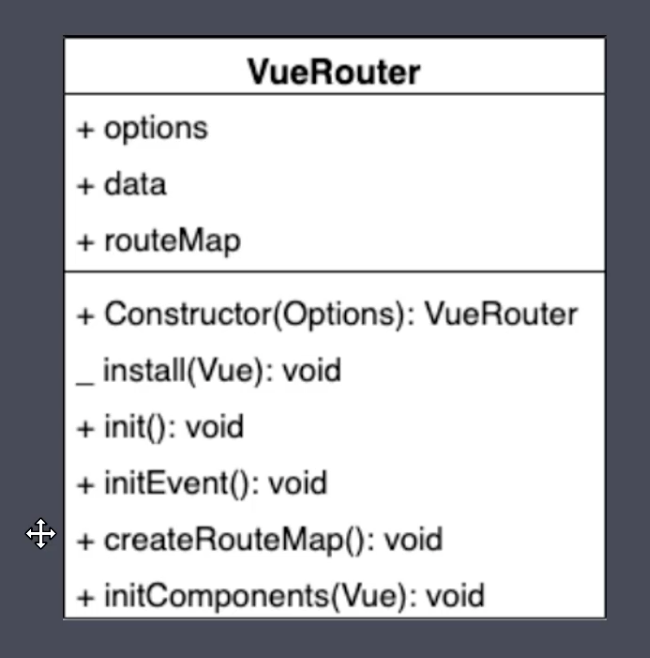
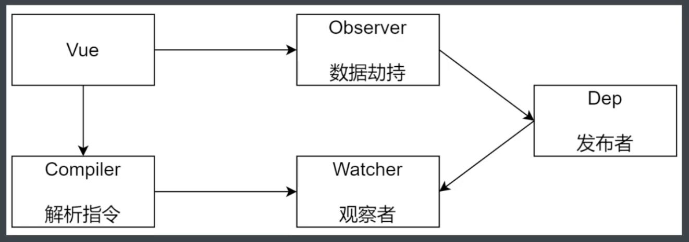
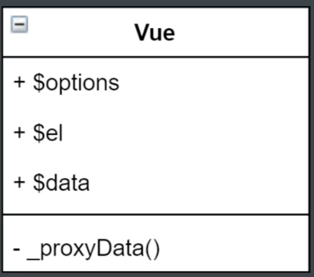
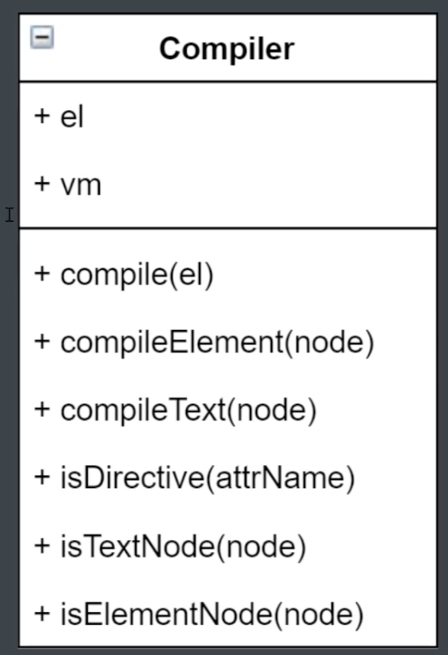
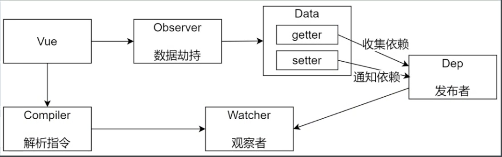
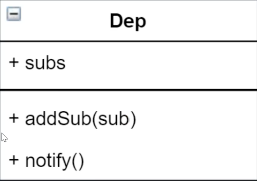
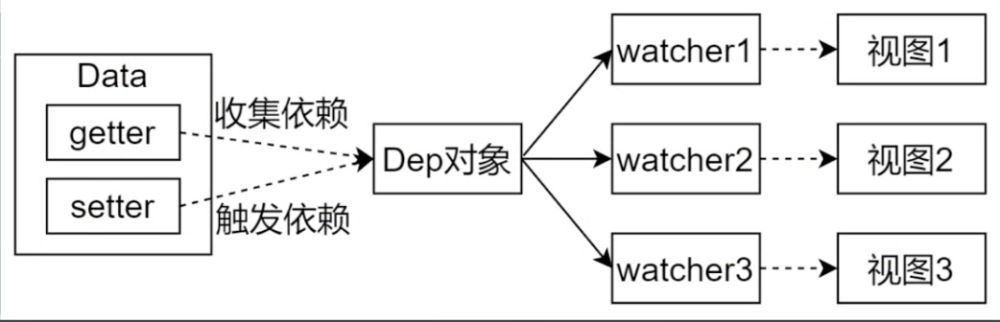
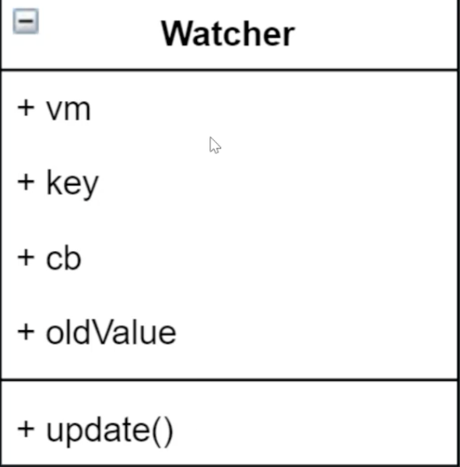
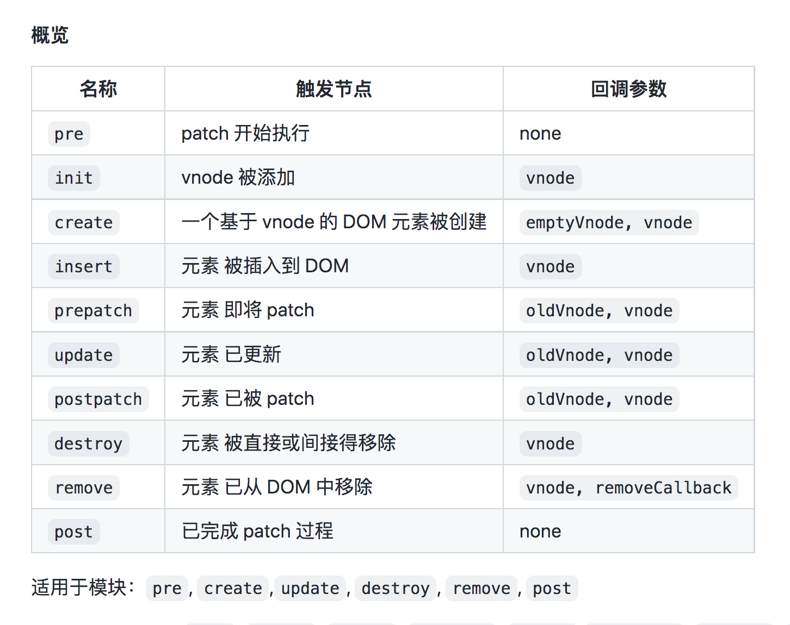
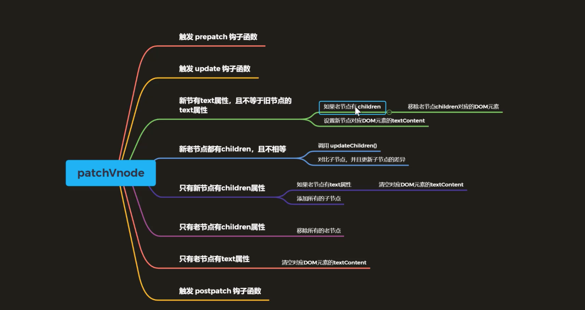

### Vue Router
#### Vue Router基本使用
##### Vue Router 使用步骤
1. 注册路由插件
```javascript
import VueRouter from 'vue-router'
Vue.use(VueRouter)
```
2. 路由规则
```javascript
const routes = [
  {
    path: '/',
    name: 'Index',
    component: Index
  },
]
```
3. 创建 router 对象
```javascript
const router = new VueRouter({
  routes
})

export default router
```
4. 注册 router 对象
```javascript
new Vue({
  // 注册 router 对象
  router,
  render: h => h(App)
}).$mount('#app')
```
5. 创建链接
```html
<div id="nav">
    <!-- 5. 创建链接 -->
    <router-link to="/">Index</router-link> |
    <router-link to="/blog">Blog</router-link> |
    <router-link to="/photo">Photo</router-link>
</div>
```
6. 创建路由组建的占位
```html
<router-view/>
```
##### 动态路由
```javascript
const routes = [
  {
    path: '/',
    name: 'Index',
    component: Index
  },
  {
    path: '/detail/:id',
    name: 'Detail',
    // 开启 props，会把 URL 中的参数传递给组件
    // 在组件中通过 props 来接收 URL 参数
    props: true,
    // route level code-splitting
    // this generates a separate chunk (about.[hash].js) for this route
    // which is lazy-loaded when the route is visited.
    component: () => import(/* webpackChunkName: "detail" */ '../views/Detail.vue')
  }
]
```
```html
<template>
  <div>
    <!-- 方式1： 通过当前路由规则，获取数据 -->
    通过当前路由规则获取：{{ $route.params.id }}

    <br>
    <!-- 方式2：路由规则中开启 props 传参 -->
    通过开启 props 获取：{{ id }}
  </div>
</template>

<script>
export default {
  name: 'Detail',
  props: ['id']
}
</script>

<style>

</style>

```
##### 嵌套路由
##### 编程式导航
```javascript
this.$router.replace('/login'); // 不记录进历史
this.$router.push({ name: 'detail', params: { id: 1 } }); // 记录进历史
this.$router.go(-1); // 回退历史
```
##### Hash和History
Hash: onhashchange 事件
History: HTML5中的history API
history.pushState()
history.replaceState()

##### History模式
在history模式时，刷新页面，页面会向服务器发送请求: http://localhost:3000/about
但是服务器上不存在这个路由，所以服务端需要配置，当找不到路由时，返回index.html

当我们再点击跳转路由时，浏览器只是调用了`history.pushState()`或`history.replaceState()`并没有向后端发送请求，所以没有问题

##### nginx的配置
```
location /fv/ {
    try_files $uri $uri/ /index.html =404;
}
```
try_files: 尝试请求浏览器所请求的路由，如果没有的话，就去找这个文件夹'$uri/'，如果文件夹'$uri/'还是没有的话，就返回index.html

##### VueRouter 实现原理
- Hash模式
URL中#后面的内容作为路径地址(如果只改变#后的url，记录到浏览器的访问历史中，浏览器不会向服务器发送请求)
监听hashChange事件
根据当前路由地址找到对应组件重新渲染
- History模式
通过history.pushState()方法改变地址栏
`history.pushState()`方法仅仅是改变地址栏，并且把地址记录到浏览器的访问历史中，并不会向服务器发送请求
监听 popstate事件，可以监听到浏览器历史的变化，可以记录改变后的地址
（注：pushState方法和replaceState方法不会触发popstate事件，只有手动点击前进和后退时，或者调用history.back或history.forword方法时才会触发）
根据当前路由地址找到对应组件重新渲染

##### history API
- history.pushState() 可以添加历史记录
- history.replaceState() 可以修改历史记录
- popstate 当活动历史记录条目更改时，触发popstate事件。

##### VueRouter 模拟实现分析

属性：
options: 用来存储路由规则
data: 对象，current属性，记录当前路由，响应式数据
routeMap: 路由规则的映射（路由地址和组件的映射）
方法：
静态方法：
install: vue的插件
实例方法：
constructor：
init：分别调用下面的方法
initEvent：注册popState事件
createRouteMap：初始化routeMap
initComponents：初始化router-view和router-link

##### 复习一下插件
插件通常用来给Vue添加全局功能，插件的功能范围没有严格的限制，一般有以下几类
1. 添加全局方法或属性
2. 添加全局资源：指令/过滤器/过渡(?)
3. 通过全局混入来添加一些组件选项
4. 添加Vue的实例方法，一般通过把他们添加到Vue.prototype上实现
5. 一个库，提供自己的 API，同时提供上面提到的一个或多个功能

###### Vue的构建版本
运行时版：不支持template模板，需要打包的时候提前编译
完整版：包含运行时和编译器，体积比运行时版大10k左右，程序运行的时候把模板转换成render函数
##### $options
用于当前Vue实例的初始化选项，需要在选项中包含自定义选项时有用
##### $slot
用来访问被插槽分发的内容，每个具名插槽都有其相应的属性(例如：`v-slot:foo` 中的内容将会在`vm.$slots.foo`中被找到)
default 属性包括了所有没有被包括到具名插槽中的节点，或v-slot:default
##### render函数的数据对象
```javascript
{
    // 与`v-bind:class`的API相同
    // 接收一个字符串，对象，或字符串和数组组成的数组
    class: {
        foo: true,
        bar: false,
    },
    // 与`v-bind:style`的API相同
    // 接收一个字符串，对象，或对象组成的数组
    style: {
        color: 'red',
        fontSize: '14px',
    },
    // 普通的 HTML attribute
    attrs: {
        id: 'foo'
    },
    // 组件的prop
    props: {
        myProp: 'bar',
    },
    // 事件监听器在 `on` 内，
    // 但不再支持如 `v-on:keyup.enter` 这样的修饰器。
    // 需要在处理函数中手动检查 keyCode。
    on: {
        click: this.clickHandler
    },
    // 作用域插槽的格式为
    // { name: props => VNode | Array<VNode> }
    scopedSlote: {
        default: props => h('span', props.text)
    },
    slot: 'name-of-slot',
    // 其它特殊顶层 property
    key: 'myKey',
    ref: 'myRef',
    // 如果你在渲染函数中给多个元素都应用了相同的 ref 名，
    // 那么 `$refs.myRef` 会变成一个数组。
    refInFor: true
}
```
##### 动手实现vue-router
https://gitee.com/HelenYin/vue-router-toy/blob/master/src/vuerouter/index.js

### 模拟响应式原理
#### 数据驱动
1. 数据响应式：数据模型仅仅是普通的js对象，而我们修改数据时，视图会进行更新，避免了繁琐的DOM操作
2. 双向绑定：数据改变，视图改变；视图改变，数据也随之改变。我们可以使用v-model在表单元素上创建双向数据绑定
3. 数据驱动：开发过程中仅需要关注数据本身，不需要关注数据是如何渲染到视图
#### 数据响应式核心原理-Vue2.x
```html
<div id="app">Hello World</div>
```
```javascript
const data = { msg: 'Hello World', count: 0 };
const vm = {};
Object.keys(data).forEach(key => {
    Object.defineProperty(vm, key, {
        enumerable: true,
        configurable: true,
        get () {
            return data[key];
        }
        set (newValue) {
            if (newValue === data[key]) {
                return;
            }
            data[key] = newValue;
            document.querySelector('#app').textContent = data[key];
        }
    });
});
```
#### 数据响应式核心原理-Vue3.x
```html
<div id="app">Hello World</div>
```
```javascript
const data = { msg: 'Hello World', count: 0 };
const vm = new Proxy(data, {
    get(target, key) {
        return target[key];
    },
    set(target, key, newValue) {
        if (target[key] === newValue) {
            return;
        }
        target[key] = newValue;
        document.querySelector('#app').textContent = data[key];
    }
})
```
从代码层面上来看，使用Proxy代码会更简洁(因为Proxy会代理整个对象，不需要想 Object.defineProperty() 遍历对象)
浏览器会优化Proxy性能，性能会更好

#### 观察者模式
```javascript
class Dep {
    constructor() {
        this.subs = []
    }
    addSub(sub) {
        if (sub && sub.update) {
            this.subs.push(sub)
        }
    }
    notify() {
        this.subs.forEach(sub => sub.update())
    }
}
class Watcher {
    update() {
        console.log('update');
    }
}
```

#### 模拟Vue响应式原理-分析
`$data`
data选项中的成员被记录到$data中，并且转换成了getter和setter
`$data`中的对象是监听数据变化的地方
`$options`
将构造函数的参数记录到了$options里
`$el`


#### Vue

#### Observer
#### compiler
功能：
- 负责编译模板，插值表达式/指令
- 负责页面的首次渲染
- 当数据变化后重新渲染视图
类图:

compile(el): 遍历所有节点，如果所有解析都写在compile里，代码量太大，所以需要
分为一项两个方法
compileElement： 解析element，是为了解析指令
compileText： 解析文本节点是为了解析插值表达式
isElementNode
isTextNode
isDirective

nodeType：


#### dep
响应式实现过程

类图


#### watcher
watcher流程图

watcher类图


https://gitee.com/HelenYin/vue-mini

### Virtual DOM的实现和原理
#### 什么是虚拟DOM
是由普通的JS对象来描述DOM对象

#### 为什么要使用Virtural DOM
跟踪状态变化
虚拟DOM可以维护程序的状态，跟踪上一次的状态
通过比较前后两次状态差异更新真实DOM

#### 虚拟DOM的作用
- 维护视图和状态的关系
- 复杂视图情况下提升渲染性能
- 跨平台：
 - 浏览器平台渲染DOM
 - 服务端渲染SSR(Nuxt.js/Next.js)
 - 原生应用(Weex/React Native)
 - 小程序(mpvue/uni-app)

 #### snabbdom中模块的作用
 snabbdom中的模块是通过注册全局钩子函数来实现的

#### snabbdom源码
##### 如何看源码
- 宏观了解
- 带着目标看源码
- 看主线逻辑，分支忽略不看
- 调试
- 参考资料
##### snabbdom 的核心
- init()设置模块，创建patch函数
- 使用h() 函数创建js对象(vnode)，描述真实DOM
- patch() 比较新旧两个vnode
- 把变化的内容更新到新的DOM

##### 函数重载
https://www.jb51.net/article/231642.htm
重载签名
实现签名
```typescript
// 重载签名
function greet(person: string): string;
function greet(persons: string[]): string[];
  
// 实现签名
function greet(person: unknown): unknown {
  if (typeof person === 'string') {
    return `Hello, ${person}!`;
  } else if (Array.isArray(person)) {
    return person.map(name => `Hello, ${name}!`);
  }
  throw new Error('Unable to greet');
}
```
虽然实现签名实现了函数行为，但是它不能直接调用。只有重载签名是可调用的。
```typescript
greet('World');          // 重载签名可调用
greet(['小智', '大冶']); // 重载签名可调用
 
const someValue: unknown = 'Unknown';
greet(someValue);       // Implementation signature NOT callable
 
// 报错
No overload matches this call.
  Overload 1 of 2, '(person: string): string', gave the following error.
    Argument of type 'unknown' is not assignable to parameter of type 'string'.
  Overload 2 of 2, '(persons: string[]): string[]', gave the following error.
    Argument of type 'unknown' is not assignable to parameter of type 'string[]'.
```
实现签名必须是通用的
```typescript
// 重载签名
function greet(person: string): string;
function greet(persons: string[]): string[]; 
// 此重载签名与其实现签名不兼容。
 
  
// 实现签名
function greet(person: unknown): string {
  // ...
  throw new Error('Unable to greet');
}
```
对象的方法也可以重载

##### 看源码快捷键(mac)
f12: 跳转到函数定义处
ctr + +: 返回上一步（查看定义后返回）

##### patch整体过程分析
- patch(oldVnode, newVnode)
- 把新节点中变化的内容渲染到真实DOM，最后返回新节点作为下一次处理的旧节点
- 对比新旧VNode，是否是相同节点(节点的key和sel相同)
- 如果不是相同节点，删除之前的内容，重新渲染
- 如果是相同节点，在判断新的VNode是否有text，如果有并且和oldVnode的text不同，直接更新文本节点
- 如果新的VNode有children，在判断子节点是否有变化

##### Snabbdom Hooks
Snabbdom 提供了一系列丰富的生命周期函数，这些生命周期函数适用于拓展 Snabbdom 模块或者在虚拟节点生命周期中执行任意代码。


补充：
- `??=`运算符
左侧变量的值为`null`或者`undefined`时，就会将右侧变量赋值给左侧变量
其他情况都不会赋值
```javascript
vnode.data ??= {};
oldVnode.data ??= {};
```
- `??`运算符
```javascript
b = a ?? c
```
a如果是`null`或者`undefined`，就会把c赋值给b

##### patchVnode
整体思路:



