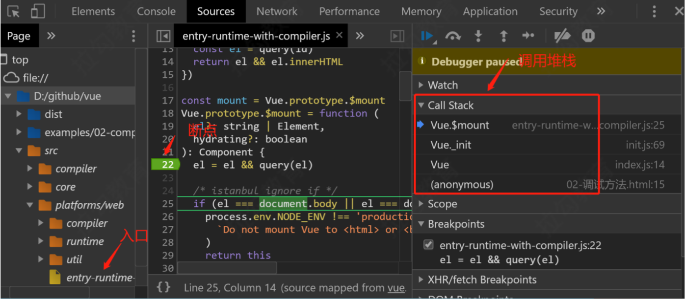

## Vue的响应式原理源码
### 准备工作&调试
1. 将sourcemap打开，这样调试才能看到src目录下的文件
2. 修改example中的引入vue文件的路径

### Vue构建后的不同版本


### 通过阅读源码，回答下面代码在页面上的输出结果
同时设置render和template会渲染哪一个？
```javascript
const vm = new Vue({
  el: '#app',
  template: '<h3>Hello template</h3>',
  render(h) {
    return h('h3', 'Hello render'),
  },
});
```
阅读源码记录:
- el 不能是 body 或者 html 标签
- 如果没有 render，把 template 转换成 render 函数 
- 如果有 render 方法，直接调用 mount 挂载 DOM
```javascript
// 1. el 不能是 body 或者 html
if (el === document.body || el === document.documentElement) {
    process.env.NODE_ENV !== 'production' && warn(
      `Do not mount Vue to <html> or <body> - mount to normal elements instead.`
    )
    return this
}
const options = this.$options
if (!options.render) {
  // 2. 把 template/el 转换成 render 函数
  ......
}
// 3. 调用 mount 方法，挂载 DOM
return mount.call(this, el, hydrating)
```
调试代码:
```javascript
const vm = new Vue({
  el: '#app',
  template: '<h3>Hello template</h3>',
  render (h) {
    return h('h4', 'Hello render')
  }
})
```
调试：
